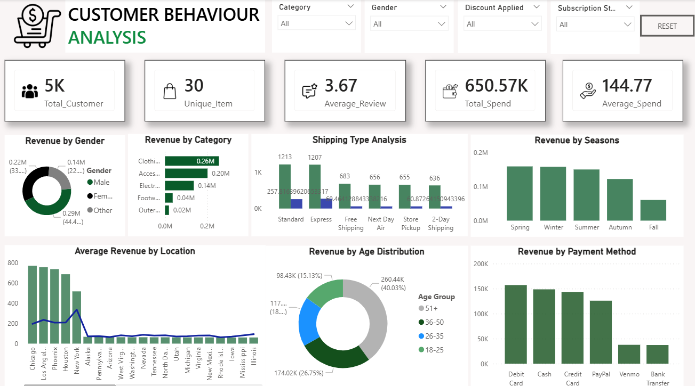
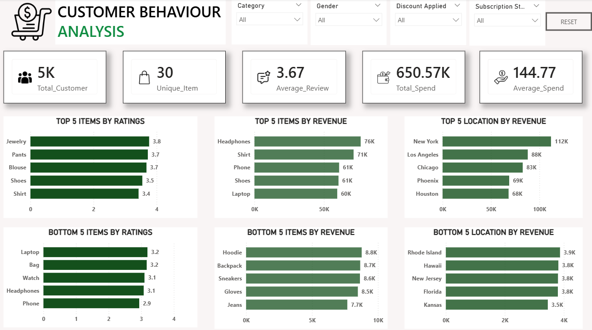

# Customer Behaviour Analysis Dashboard

## Project Overview
This project analyzes customer shopping behavior using Power BI, SQL, and Python.

An interactive dashboard was developed to understand customer purchasing patterns, revenue trends, product performance, seasonal analysis, and customer demographics.

---

## Problem Statement
The business had large customer shopping datasets but faced challenges in understanding:

- Customer purchasing behavior
- Revenue trends
- Best and worst performing products
- Location-wise performance
- Seasonal sales contribution
- Preferred payment methods
- Customer demographics
- Shipping performance

The raw data lacked proper visualization and actionable insights.

---

## Solution
An interactive Power BI dashboard was created to transform raw customer data into meaningful business insights.

The dashboard helps businesses:
- Analyze customer behavior
- Identify top-performing products
- Track revenue trends
- Improve marketing strategies
- Optimize sales performance

---

## Tools & Technologies Used
- Power BI
- SQL
- Python
- Jupyter Notebook
- CSV Dataset
- Data Cleaning
- Data Visualization

---

## Dashboard Features
- Interactive filters
- Revenue analysis
- Category-wise analysis
- Customer demographic analysis
- Seasonal revenue analysis
- Payment method analysis
- Shipping analysis
- Product performance tracking

---

## Key Insights

### 1. Female Customers Contributed Higher Revenue
Female customers generated significant sales contribution.

### 2. Adults and Middle-Age Customers Were Major Buyers
Age groups 26–50 generated maximum revenue.

### 3. Clothing Category Generated Highest Revenue
Clothing and accessories were the best-performing categories.

### 4. New York Was the Top Revenue Generating Location
New York generated highest sales revenue.

### 5. Headphones and Shirts Were Top Revenue Products
These products generated maximum revenue.

### 6. Seasonal Trends Were Identified
Spring and Winter seasons contributed strong revenue performance.

### 7. Debit Card Was Most Preferred Payment Method
Most customers preferred debit card transactions.

### 8. Standard and Express Shipping Were Most Used
Customers preferred faster delivery methods.

### 9. Low Performing Products Were Identified
Jeans, gloves, and hoodies contributed lower revenue.

---

## Dashboard Preview

---

## Project Files
- Power BI Dashboard (.pbix)
- SQL File
- Python Notebook
- CSV Dataset
- Dashboard Screenshots

---

## Conclusion
The dashboard successfully transformed raw customer shopping data into meaningful business insights and improved understanding of customer behavior, revenue trends, product performance, and operational efficiency.

---

## Author
Bhoomika Gouda
